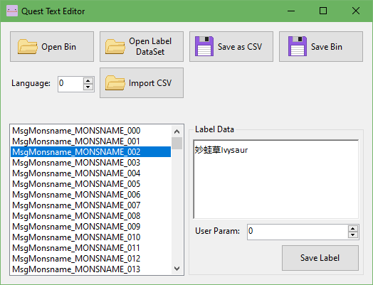

# Quest Text Editor

A tool to edit the Mobile version of Pokémon Quest's encrypted TextAssets.

 

## Features

### Editor

A full editor to change any label of an imported Pokémon Quest TextAsset.
- Import a UABEA exported .bytes file from the TextAsset in an AssetBundle.
- Select the language block to look at.
- Select a label to edit in the list and then change its contents and its UserParam.
- The editor automatically re-calculates the Metadata of the file so the labels are read properly.
- Rebuilding the binary file is done in either "non-coded" mode (raw UTF-8 encoded strings) or "coded" mode (encoded like it normally is in vanilla).
- The exported binary file can be re-imported in UABEA.

### CSV Importer/Exporter

If you just want to import/export the text from/to a .csv file, you can!
In both cases, the format is headerless with the values LabelName, Value, UserParam, in that order.
- Import a CSV file to replace labels.
  - Does not add new labels if it cannot find specific label names from the CSV in the currently loaded .bytes file.
- Export the currently loaded labels to a CSV file.

## Special Thanks

- ­[xiofee](https://github.com/xiofee) for the original [Pokémon Quest Text Decoder](https://github.com/xiofee/Pokemon-Quest-Text-Decoder) from which this repo is forked.
- [Kurt (kwsch)](https://github.com/kwsch) for making [xytext](https://github.com/kwsch/xytext) which also allows editing this format of file.